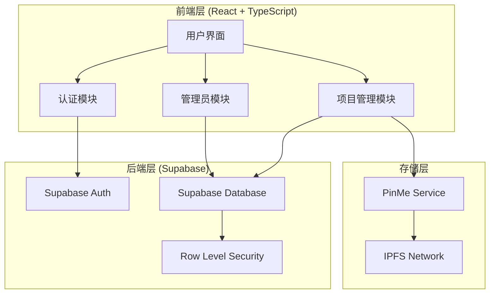

# 设计文档

## 概述

本设计文档描述了 PinMe 用户项目管理系统的技术实现方案。该系统基于现有的 Supabase 示例项目进行扩展，添加用户认证、项目管理和管理员功能。

### 设计目标

1. **简单的用户认证**：基于用户名/密码的注册和登录，无需邮箱验证
2. **项目版本管理**：支持项目的创建、更新和历史版本追踪
3. **管理员功能**：管理员可以查看所有用户并重置密码
4. **美观的卡片式界面**：响应式设计，支持桌面和移动设备
5. **保持现有流程**：不改变现有的 PinMe CLI 上传流程

---

## 架构设计

### 整体架构



### 技术栈

- **前端框架**：React 18 + TypeScript
- **构建工具**：Vite
- **路由**：React Router v6
- **状态管理**：React Context API + Hooks
- **UI 组件**：自定义组件（基于现有样式）
- **后端服务**：Supabase (PostgreSQL + Auth)
- **存储**：IPFS (通过 PinMe CLI)
- **样式**：CSS Modules

---

## 组件架构

### 页面组件

```
src/
├── pages/
│   ├── Auth/
│   │   ├── Login.tsx           # 登录页面
│   │   ├── Register.tsx        # 注册页面
│   │   └── Auth.css
│   ├── Dashboard/
│   │   ├── Dashboard.tsx       # 项目仪表板（主页）
│   │   ├── ProjectCard.tsx     # 项目卡片组件
│   │   ├── ProjectDetail.tsx   # 项目详情页
│   │   ├── UploadModal.tsx     # 上传对话框
│   │   ├── UpdateModal.tsx     # 更新版本对话框
│   │   └── Dashboard.css
│   ├── Settings/
│   │   ├── Settings.tsx        # 用户设置页面
│   │   ├── ChangePassword.tsx  # 修改密码组件
│   │   └── Settings.css
│   └── Admin/
│       ├── UserManagement.tsx  # 用户管理页面
│       ├── UserList.tsx        # 用户列表组件
│       ├── ResetPasswordModal.tsx  # 重置密码对话框
│       └── Admin.css
```

### 共享组件

```
src/
├── components/
│   ├── Layout/
│   │   ├── Header.tsx          # 顶部导航栏
│   │   ├── Sidebar.tsx         # 侧边栏（可选）
│   │   └── Layout.tsx          # 布局容器
│   ├── Common/
│   │   ├── Button.tsx          # 按钮组件
│   │   ├── Input.tsx           # 输入框组件
│   │   ├── Modal.tsx           # 模态对话框
│   │   ├── Card.tsx            # 卡片组件
│   │   ├── Badge.tsx           # 徽章组件
│   │   ├── Toast.tsx           # 提示消息
│   │   └── Loading.tsx         # 加载指示器
│   └── ProtectedRoute.tsx      # 路由守卫
```

### 工具模块

```
src/
├── utils/
│   ├── supabase.ts             # Supabase 客户端配置
│   ├── auth.ts                 # 认证工具函数
│   ├── upload.ts               # 上传工具函数
│   ├── format.ts               # 格式化工具（时间、文件大小等）
│   └── validation.ts           # 表单验证工具
├── hooks/
│   ├── useAuth.ts              # 认证 Hook
│   ├── useProjects.ts          # 项目管理 Hook
│   ├── useUpload.ts            # 上传 Hook
│   └── useAdmin.ts             # 管理员 Hook
├── contexts/
│   ├── AuthContext.tsx         # 认证上下文
│   └── ToastContext.tsx        # 提示消息上下文
└── types/
    ├── user.ts                 # 用户类型定义
    ├── project.ts              # 项目类型定义
    └── api.ts                  # API 类型定义
```

---

## 数据模型

### 数据库表结构

#### 1. users 表

```sql
CREATE TABLE users (
  id UUID PRIMARY KEY DEFAULT uuid_generate_v4(),
  username VARCHAR(20) UNIQUE NOT NULL,
  password_hash TEXT NOT NULL,
  is_admin BOOLEAN DEFAULT FALSE,
  created_at TIMESTAMP WITH TIME ZONE DEFAULT NOW(),
  last_login_at TIMESTAMP WITH TIME ZONE,
  CONSTRAINT username_length CHECK (char_length(username) >= 3 AND char_length(username) <= 20)
);

-- 索引
CREATE INDEX idx_users_username ON users(username);
CREATE INDEX idx_users_is_admin ON users(is_admin);
```

#### 2. projects 表

```sql
CREATE TABLE projects (
  id UUID PRIMARY KEY DEFAULT uuid_generate_v4(),
  user_id UUID NOT NULL REFERENCES users(id) ON DELETE CASCADE,
  name VARCHAR(100) NOT NULL,
  description TEXT,
  current_version_id UUID,
  domain VARCHAR(100),
  created_at TIMESTAMP WITH TIME ZONE DEFAULT NOW(),
  updated_at TIMESTAMP WITH TIME ZONE DEFAULT NOW(),
  deleted_at TIMESTAMP WITH TIME ZONE,
  CONSTRAINT project_name_length CHECK (char_length(name) >= 1 AND char_length(name) <= 100)
);

-- 索引
CREATE INDEX idx_projects_user_id ON projects(user_id);
CREATE INDEX idx_projects_deleted_at ON projects(deleted_at);
CREATE INDEX idx_projects_updated_at ON projects(updated_at DESC);
```

#### 3. project_versions 表

```sql
CREATE TABLE project_versions (
  id UUID PRIMARY KEY DEFAULT uuid_generate_v4(),
  project_id UUID NOT NULL REFERENCES projects(id) ON DELETE CASCADE,
  version_number INTEGER NOT NULL,
  ipfs_cid VARCHAR(100) NOT NULL,
  preview_url TEXT NOT NULL,
  description TEXT,
  file_count INTEGER,
  total_size BIGINT,
  created_at TIMESTAMP WITH TIME ZONE DEFAULT NOW(),
  CONSTRAINT version_number_positive CHECK (version_number > 0)
);

-- 索引
CREATE INDEX idx_versions_project_id ON project_versions(project_id);
CREATE INDEX idx_versions_created_at ON project_versions(created_at DESC);

-- 外键约束（设置当前版本）
ALTER TABLE projects 
  ADD CONSTRAINT fk_current_version 
  FOREIGN KEY (current_version_id) 
  REFERENCES project_versions(id) 
  ON DELETE SET NULL;
```

### Row Level Security (RLS) 策略

```sql
-- 启用 RLS
ALTER TABLE users ENABLE ROW LEVEL SECURITY;
ALTER TABLE projects ENABLE ROW LEVEL SECURITY;
ALTER TABLE project_versions ENABLE ROW LEVEL SECURITY;

-- users 表策略
-- 用户只能查看自己的信息，管理员可以查看所有用户
CREATE POLICY "Users can view own data" ON users
  FOR SELECT USING (auth.uid() = id OR (SELECT is_admin FROM users WHERE id = auth.uid()));

-- 用户可以更新自己的密码和最后登录时间
CREATE POLICY "Users can update own data" ON users
  FOR UPDATE USING (auth.uid() = id);

-- 管理员可以更新任何用户
CREATE POLICY "Admins can update any user" ON users
  FOR UPDATE USING ((SELECT is_admin FROM users WHERE id = auth.uid()));

-- projects 表策略
-- 用户只能查看自己的项目（未删除）
CREATE POLICY "Users can view own projects" ON projects
  FOR SELECT USING (user_id = auth.uid() AND deleted_at IS NULL);

-- 管理员可以查看所有项目
CREATE POLICY "Admins can view all projects" ON projects
  FOR SELECT USING ((SELECT is_admin FROM users WHERE id = auth.uid()));

-- 用户可以创建自己的项目
CREATE POLICY "Users can create own projects" ON projects
  FOR INSERT WITH CHECK (user_id = auth.uid());

-- 用户可以更新自己的项目
CREATE POLICY "Users can update own projects" ON projects
  FOR UPDATE USING (user_id = auth.uid());

-- 用户可以删除（软删除）自己的项目
CREATE POLICY "Users can delete own projects" ON projects
  FOR DELETE USING (user_id = auth.uid());

-- project_versions 表策略
-- 用户可以查看自己项目的版本
CREATE POLICY "Users can view own project versions" ON project_versions
  FOR SELECT USING (
    EXISTS (
      SELECT 1 FROM projects 
      WHERE projects.id = project_versions.project_id 
      AND projects.user_id = auth.uid()
    )
  );

-- 用户可以创建自己项目的版本
CREATE POLICY "Users can create own project versions" ON project_versions
  FOR INSERT WITH CHECK (
    EXISTS (
      SELECT 1 FROM projects 
      WHERE projects.id = project_versions.project_id 
      AND projects.user_id = auth.uid()
    )
  );
```

### TypeScript 类型定义

```typescript
// src/types/user.ts
export interface User {
  id: string;
  username: string;
  is_admin: boolean;
  created_at: string;
  last_login_at: string | null;
}

export interface LoginCredentials {
  username: string;
  password: string;
}

export interface RegisterData {
  username: string;
  password: string;
  confirmPassword: string;
}

export interface ChangePasswordData {
  currentPassword: string;
  newPassword: string;
  confirmPassword: string;
}

// src/types/project.ts
export interface Project {
  id: string;
  user_id: string;
  name: string;
  description: string | null;
  current_version_id: string | null;
  domain: string | null;
  created_at: string;
  updated_at: string;
  deleted_at: string | null;
  current_version?: ProjectVersion;
  version_count?: number;
}

export interface ProjectVersion {
  id: string;
  project_id: string;
  version_number: number;
  ipfs_cid: string;
  preview_url: string;
  description: string | null;
  file_count: number | null;
  total_size: number | null;
  created_at: string;
}

export interface CreateProjectData {
  name: string;
  description?: string;
  domain?: string;
  files: FileList;
}

export interface UpdateProjectData {
  project_id: string;
  description?: string;
  files: FileList;
}
```

---

## API 设计

### 认证 API

由于我们使用自定义的用户名/密码认证（而非 Supabase Auth 的邮箱认证），需要创建自定义认证函数。

#### 注册

```typescript
// src/utils/auth.ts
export async function register(data: RegisterData): Promise<User> {
  // 1. 验证用户名唯一性
  const { data: existingUser } = await supabase
    .from('users')
    .select('id')
    .eq('username', data.username)
    .single();
  
  if (existingUser) {
    throw new Error('用户名已存在');
  }
  
  // 2. 哈希密码（使用 bcrypt 或类似库）
  const passwordHash = await hashPassword(data.password);
  
  // 3. 创建用户
  const { data: user, error } = await supabase
    .from('users')
    .insert({
      username: data.username,
      password_hash: passwordHash,
      is_admin: false
    })
    .select()
    .single();
  
  if (error) throw error;
  
  // 4. 创建会话（使用 Supabase Auth 的自定义令牌）
  await createSession(user);
  
  return user;
}
```

#### 登录

```typescript
export async function login(credentials: LoginCredentials): Promise<User> {
  // 1. 查找用户
  const { data: user, error } = await supabase
    .from('users')
    .select('*')
    .eq('username', credentials.username)
    .single();
  
  if (error || !user) {
    throw new Error('用户名或密码错误');
  }
  
  // 2. 验证密码
  const isValid = await verifyPassword(credentials.password, user.password_hash);
  if (!isValid) {
    throw new Error('用户名或密码错误');
  }
  
  // 3. 更新最后登录时间
  await supabase
    .from('users')
    .update({ last_login_at: new Date().toISOString() })
    .eq('id', user.id);
  
  // 4. 创建会话
  await createSession(user);
  
  return user;
}
```

### 项目管理 API

#### 获取项目列表

```typescript
export async function getProjects(userId: string): Promise<Project[]> {
  const { data, error } = await supabase
    .from('projects')
    .select(`
      *,
      current_version:project_versions!current_version_id(*),
      version_count:project_versions(count)
    `)
    .eq('user_id', userId)
    .is('deleted_at', null)
    .order('updated_at', { ascending: false });
  
  if (error) throw error;
  return data;
}
```

#### 创建项目

```typescript
export async function createProject(
  userId: string,
  data: CreateProjectData
): Promise<Project> {
  // 1. 上传文件到 IPFS（调用 PinMe 服务）
  const uploadResult = await uploadToIPFS(data.files, data.domain);
  
  // 2. 创建项目记录
  const { data: project, error: projectError } = await supabase
    .from('projects')
    .insert({
      user_id: userId,
      name: data.name,
      description: data.description,
      domain: data.domain
    })
    .select()
    .single();
  
  if (projectError) throw projectError;
  
  // 3. 创建第一个版本
  const { data: version, error: versionError } = await supabase
    .from('project_versions')
    .insert({
      project_id: project.id,
      version_number: 1,
      ipfs_cid: uploadResult.cid,
      preview_url: uploadResult.previewUrl,
      description: '初始版本',
      file_count: uploadResult.fileCount,
      total_size: uploadResult.totalSize
    })
    .select()
    .single();
  
  if (versionError) throw versionError;
  
  // 4. 更新项目的当前版本
  await supabase
    .from('projects')
    .update({ current_version_id: version.id })
    .eq('id', project.id);
  
  return { ...project, current_version: version };
}
```

#### 更新项目版本

```typescript
export async function updateProjectVersion(
  data: UpdateProjectData
): Promise<ProjectVersion> {
  // 1. 获取当前项目信息
  const { data: project } = await supabase
    .from('projects')
    .select('*, current_version:project_versions!current_version_id(version_number)')
    .eq('id', data.project_id)
    .single();
  
  // 2. 上传新文件到 IPFS
  const uploadResult = await uploadToIPFS(data.files);
  
  // 3. 创建新版本
  const newVersionNumber = (project.current_version?.version_number || 0) + 1;
  
  const { data: version, error } = await supabase
    .from('project_versions')
    .insert({
      project_id: data.project_id,
      version_number: newVersionNumber,
      ipfs_cid: uploadResult.cid,
      preview_url: uploadResult.previewUrl,
      description: data.description,
      file_count: uploadResult.fileCount,
      total_size: uploadResult.totalSize
    })
    .select()
    .single();
  
  if (error) throw error;
  
  // 4. 更新项目的当前版本和更新时间
  await supabase
    .from('projects')
    .update({ 
      current_version_id: version.id,
      updated_at: new Date().toISOString()
    })
    .eq('id', data.project_id);
  
  return version;
}
```

### 管理员 API

#### 获取所有用户

```typescript
export async function getAllUsers(): Promise<User[]> {
  const { data, error } = await supabase
    .from('users')
    .select(`
      *,
      project_count:projects(count)
    `)
    .order('created_at', { ascending: false });
  
  if (error) throw error;
  return data;
}
```

#### 重置用户密码

```typescript
export async function resetUserPassword(
  userId: string,
  newPassword: string
): Promise<void> {
  const passwordHash = await hashPassword(newPassword);
  
  const { error } = await supabase
    .from('users')
    .update({ password_hash: passwordHash })
    .eq('id', userId);
  
  if (error) throw error;
}
```

---

## UI 设计

### 设计系统

#### 颜色方案

```css
:root {
  /* 主色调 */
  --primary-color: #4F46E5;
  --primary-hover: #4338CA;
  --primary-light: #EEF2FF;
  
  /* 中性色 */
  --gray-50: #F9FAFB;
  --gray-100: #F3F4F6;
  --gray-200: #E5E7EB;
  --gray-300: #D1D5DB;
  --gray-400: #9CA3AF;
  --gray-500: #6B7280;
  --gray-600: #4B5563;
  --gray-700: #374151;
  --gray-800: #1F2937;
  --gray-900: #111827;
  
  /* 语义色 */
  --success-color: #10B981;
  --warning-color: #F59E0B;
  --error-color: #EF4444;
  --info-color: #3B82F6;
  
  /* 背景色 */
  --bg-primary: #FFFFFF;
  --bg-secondary: #F9FAFB;
  --bg-tertiary: #F3F4F6;
  
  /* 文字色 */
  --text-primary: #111827;
  --text-secondary: #6B7280;
  --text-tertiary: #9CA3AF;
  
  /* 边框 */
  --border-color: #E5E7EB;
  --border-radius: 8px;
  --border-radius-lg: 12px;
  
  /* 阴影 */
  --shadow-sm: 0 1px 2px 0 rgba(0, 0, 0, 0.05);
  --shadow-md: 0 4px 6px -1px rgba(0, 0, 0, 0.1);
  --shadow-lg: 0 10px 15px -3px rgba(0, 0, 0, 0.1);
  --shadow-xl: 0 20px 25px -5px rgba(0, 0, 0, 0.1);
}
```

#### 排版

```css
:root {
  /* 字体 */
  --font-family: -apple-system, BlinkMacSystemFont, 'Segoe UI', 'Roboto', 'Oxygen',
    'Ubuntu', 'Cantarell', 'Fira Sans', 'Droid Sans', 'Helvetica Neue', sans-serif;
  
  /* 字号 */
  --text-xs: 0.75rem;    /* 12px */
  --text-sm: 0.875rem;   /* 14px */
  --text-base: 1rem;     /* 16px */
  --text-lg: 1.125rem;   /* 18px */
  --text-xl: 1.25rem;    /* 20px */
  --text-2xl: 1.5rem;    /* 24px */
  --text-3xl: 1.875rem;  /* 30px */
  --text-4xl: 2.25rem;   /* 36px */
  
  /* 行高 */
  --leading-tight: 1.25;
  --leading-normal: 1.5;
  --leading-relaxed: 1.75;
  
  /* 字重 */
  --font-normal: 400;
  --font-medium: 500;
  --font-semibold: 600;
  --font-bold: 700;
}
```

### 页面布局

#### 登录/注册页面

```
┌─────────────────────────────────────┐
│                                     │
│           [PinMe Logo]              │
│                                     │
│     ┌─────────────────────┐         │
│     │   登录 / 注册       │         │
│     │                     │         │
│     │  [用户名输入框]     │         │
│     │  [密码输入框]       │         │
│     │  [确认密码]（注册） │         │
│     │                     │         │
│     │  [登录/注册按钮]    │         │
│     │                     │         │
│     │  切换到注册/登录    │         │
│     └─────────────────────┘         │
│                                     │
└─────────────────────────────────────┘
```

#### 项目仪表板（卡片网格）

```
┌─────────────────────────────────────────────────────────┐
│  [Logo]  项目管理    [搜索框]      [用户] [设置] [登出] │
├─────────────────────────────────────────────────────────┤
│                                                         │
│  我的项目                          [+ 上传新项目]       │
│                                                         │
│  ┌──────────┐  ┌──────────┐  ┌──────────┐             │
│  │ [图标]   │  │ [图标]   │  │ [图标]   │             │
│  │          │  │          │  │          │             │
│  │ 项目名称 │  │ 项目名称 │  │ 项目名称 │             │
│  │ v1.2     │  │ v3.0     │  │ v1.0     │             │
│  │ 2天前    │  │ 1周前    │  │ 3周前    │             │
│  │          │  │          │  │          │             │
│  │ [更新]   │  │ [更新]   │  │ [更新]   │             │
│  │ [预览]   │  │ [预览]   │  │ [预览]   │             │
│  └──────────┘  └──────────┘  └──────────┘             │
│                                                         │
│  ┌──────────┐  ┌──────────┐                           │
│  │ [图标]   │  │ [图标]   │                           │
│  │          │  │          │                           │
│  │ 项目名称 │  │ 项目名称 │                           │
│  │ v2.1     │  │ v1.5     │                           │
│  │ 1月前    │  │ 2月前    │                           │
│  │          │  │          │                           │
│  │ [更新]   │  │ [更新]   │                           │
│  │ [预览]   │  │ [预览]   │                           │
│  └──────────┘  └──────────┘                           │
│                                                         │
└─────────────────────────────────────────────────────────┘
```

#### 管理员用户管理页面

```
┌─────────────────────────────────────────────────────────┐
│  [Logo]  用户管理    [搜索框]      [用户] [设置] [登出] │
├─────────────────────────────────────────────────────────┤
│                                                         │
│  用户列表                          总用户数: 42         │
│                                                         │
│  ┌───────────────────────────────────────────────────┐ │
│  │ 用户名    │ 注册时间   │ 最后登录 │ 项目数 │ 操作 │ │
│  ├───────────────────────────────────────────────────┤ │
│  │ alice     │ 2024-01-15 │ 2天前   │ 5      │ [重置]│ │
│  │ bob       │ 2024-01-20 │ 1周前   │ 3      │ [重置]│ │
│  │ charlie   │ 2024-02-01 │ 3天前   │ 8      │ [重置]│ │
│  │ ...       │ ...        │ ...     │ ...    │ ...  │ │
│  └───────────────────────────────────────────────────┘ │
│                                                         │
│  [上一页] 1 2 3 4 5 [下一页]                           │
│                                                         │
└─────────────────────────────────────────────────────────┘
```

---

## 错误处理

### 错误类型

```typescript
export enum ErrorCode {
  // 认证错误
  INVALID_CREDENTIALS = 'INVALID_CREDENTIALS',
  USERNAME_EXISTS = 'USERNAME_EXISTS',
  UNAUTHORIZED = 'UNAUTHORIZED',
  
  // 项目错误
  PROJECT_NOT_FOUND = 'PROJECT_NOT_FOUND',
  UPLOAD_FAILED = 'UPLOAD_FAILED',
  INVALID_FILES = 'INVALID_FILES',
  
  // 验证错误
  VALIDATION_ERROR = 'VALIDATION_ERROR',
  
  // 服务器错误
  SERVER_ERROR = 'SERVER_ERROR',
  NETWORK_ERROR = 'NETWORK_ERROR'
}

export class AppError extends Error {
  constructor(
    public code: ErrorCode,
    public message: string,
    public details?: any
  ) {
    super(message);
    this.name = 'AppError';
  }
}
```

### 错误处理策略

1. **网络错误**：显示重试按钮
2. **验证错误**：在表单字段下显示错误信息
3. **权限错误**：重定向到登录页面
4. **服务器错误**：显示友好的错误消息和联系支持选项

---

## 测试策略

### 单元测试

- 工具函数测试（验证、格式化等）
- API 函数测试（模拟 Supabase 响应）
- 自定义 Hooks 测试

### 集成测试

- 认证流程测试（注册、登录、登出）
- 项目 CRUD 操作测试
- 管理员功能测试

### E2E 测试

- 完整的用户注册和项目创建流程
- 项目版本更新流程
- 管理员重置密码流程

### 测试工具

- **单元测试**：Vitest
- **组件测试**：React Testing Library
- **E2E 测试**：Playwright（可选）

---

## 性能优化

### 前端优化

1. **代码分割**：使用 React.lazy 和 Suspense 进行路由级别的代码分割
2. **图片优化**：使用 WebP 格式，懒加载图片
3. **虚拟滚动**：项目列表使用虚拟滚动（react-window）
4. **缓存策略**：使用 React Query 或 SWR 缓存 API 响应
5. **防抖和节流**：搜索输入使用防抖

### 后端优化

1. **数据库索引**：在常用查询字段上创建索引
2. **分页**：项目列表使用分页加载
3. **连接池**：Supabase 自动处理连接池

### 上传优化

1. **分块上传**：大文件使用分块上传
2. **并行上传**：多个文件并行上传
3. **进度反馈**：实时显示上传进度

---

## 安全考虑

### 认证安全

1. **密码哈希**：使用 bcrypt 或 argon2 哈希密码
2. **会话管理**：使用 HTTP-only cookies 存储会话令牌
3. **CSRF 保护**：使用 CSRF 令牌保护表单提交

### 数据安全

1. **Row Level Security**：使用 Supabase RLS 确保数据隔离
2. **输入验证**：前后端双重验证用户输入
3. **SQL 注入防护**：使用参数化查询（Supabase 自动处理）

### 权限控制

1. **路由守卫**：未登录用户无法访问受保护页面
2. **管理员检查**：管理员功能需要验证 is_admin 标志
3. **API 权限**：每个 API 调用验证用户权限

---

## 部署策略

### 前端部署

1. **构建**：`npm run build` 生成静态文件
2. **部署**：使用 PinMe CLI 部署到 IPFS
3. **域名**：绑定自定义域名（可选）

### 数据库部署

1. **迁移**：使用 Supabase 迁移工具创建表和 RLS 策略
2. **种子数据**：创建默认管理员账户

### 环境变量

```env
VITE_SUPABASE_URL=your_supabase_url
VITE_SUPABASE_ANON_KEY=your_supabase_anon_key
VITE_PINME_API_URL=your_pinme_api_url
```

---

## 未来扩展

### 可能的功能扩展

1. **团队协作**：支持多用户协作管理项目
2. **自定义域名**：支持用户绑定自己的域名
3. **分析统计**：项目访问量统计
4. **评论系统**：项目评论和反馈
5. **模板市场**：预设项目模板
6. **API 密钥**：支持通过 API 上传项目
7. **Webhook**：项目更新时触发 Webhook
8. **备份恢复**：项目备份和恢复功能
